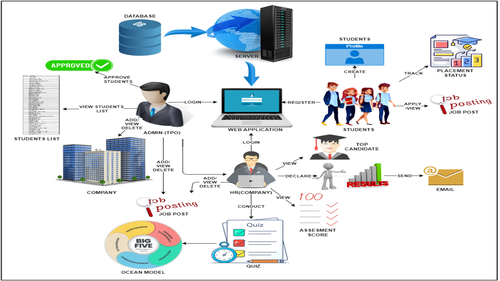
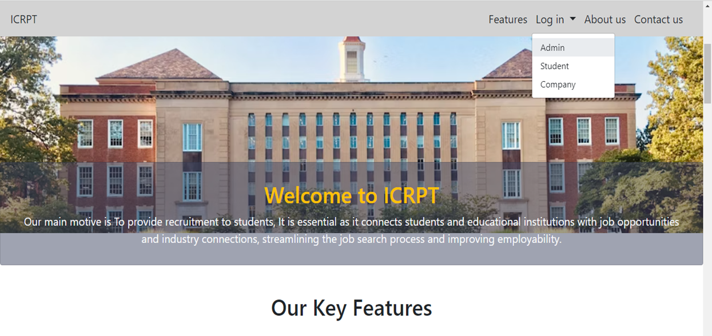

# ICRPT - Integrated Campus Recruitment, Placement & Training System

> A holistic approach to campus recruitment and student profile analysis for placement.

📥 [Download supporting files and build project from here](https://drive.google.com/drive/folders/1PN6_R3LWkOsUM34aaUsIbKl0sHXoYpBb?usp=sharing)

---

## 👨‍💻 Developed By:

- **Aditya Arun Dhakane** (400463)

> Under the guidance of **Mr. S.H. Sangale**, Lecturer, K.K. Wagh Polytechnic, Nashik  
> **Academic Year:** 2023–24

---

## 🧠 Project Abstract

The ICRPT system is a web-based platform designed to bridge the gap between academic institutions and the job market. It streamlines the student placement process through automated profile matching, skill assessments, job application tracking, and transparent communication between TPO, students, and recruiters.

It promotes **transparent**, **data-driven** recruitment that supports **career readiness** and **optimizes hiring processes**.

---

## 🔧 Technologies Used

- **Frontend:** HTML, CSS, JavaScript  
- **Backend:** PHP  
- **Database:** MySQL  
- **Web Server:** Apache (via XAMPP)  
- **IDE:** Eclipse IDE  
- **Platform:** Windows 10+

---

## 🧩 System Modules

### 👩‍🎓 Student Module
- Register/Login
- Create and update profile
- Upload resume
- Apply for jobs
- Participate in aptitude/personality tests
- Track application status

### 🧑‍🏫 Admin (TPO) Module
- Approve students
- Manage company profiles
- Post/view/delete job listings
- View assessment scores
- Generate analytics and reports

### 🧑‍💼 HR (Recruiter) Module
- Create/manage company profile
- Post job openings
- Add/view quizzes
- Evaluate candidates
- Shortlist and release results

---

## 📷 Screenshots

This project includes screenshots of:
- Home page
    
- Login & dashboard views for Admin, Student, and TPO
- Job listing & application
- Resume upload and profile update
- Aptitude test and results

📁 See `WorkingpptCP04_Seminar2_ICRPT` ppt for UI images.

---

## 📈 Results

- ✅ Reduced TPO workload through automation  
- ✅ Real-time student assessment & tracking  
- ✅ Data-driven insights for recruiters  
- ✅ Improved candidate-job matching accuracy  

---

## 📚 Documentation

Complete technical documentation and detailed explanation of design, features, and results is available in:

📄 `Final Report Black Book2.pdf`

---

## 🏁 License

This project is developed as part of the **final year capstone project** for the Diploma in Computer Technology at **K.K. Wagh Polytechnic, Nashik** under **MSBTE** academic curriculum for the year **2023–24**.

---

## 📥 How to Clone This Project

To clone this project to your local machine using Git Bash:

### 🔹 Step 1: Copy the Repository URL
**https://github.com/aadi8067/ICRPT-Placement-System.git**

### 🔹 Step 2: Open Git Bash and run the following commands:

cd /your/desired/path/
git clone https://github.com/aadi8067/ICRPT-Placement-System.git
cd ICRPT-Placement-System
Now you're inside the project folder. You can view, edit, or run the project as needed.

✅ Make sure you have Git installed: https://git-scm.com

